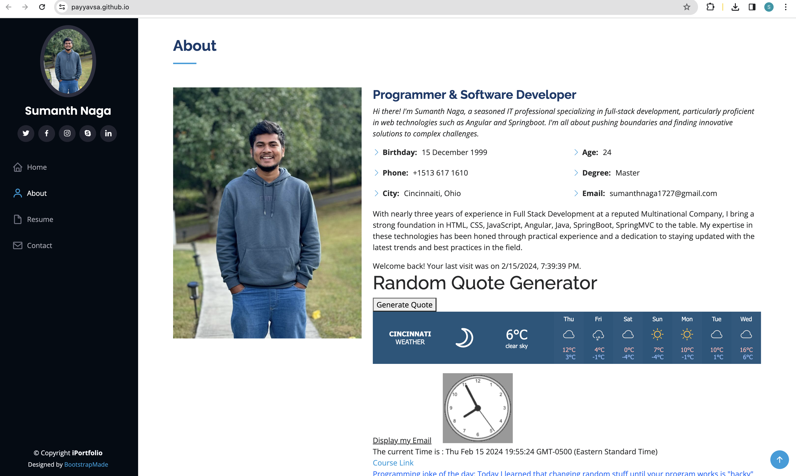
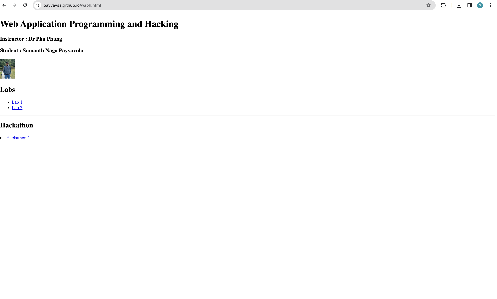
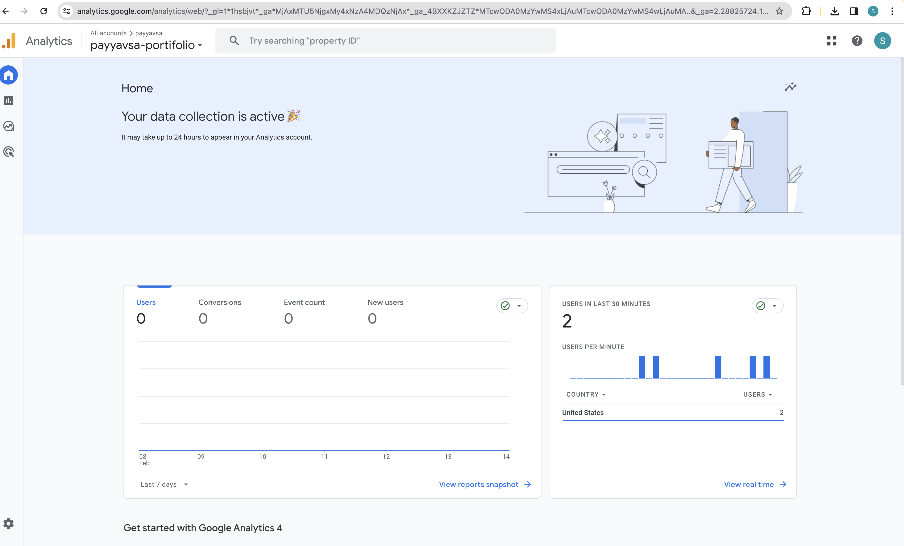
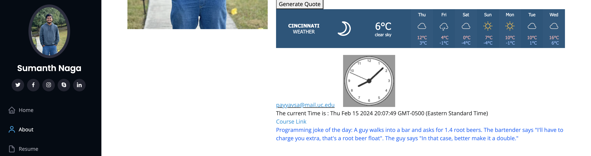
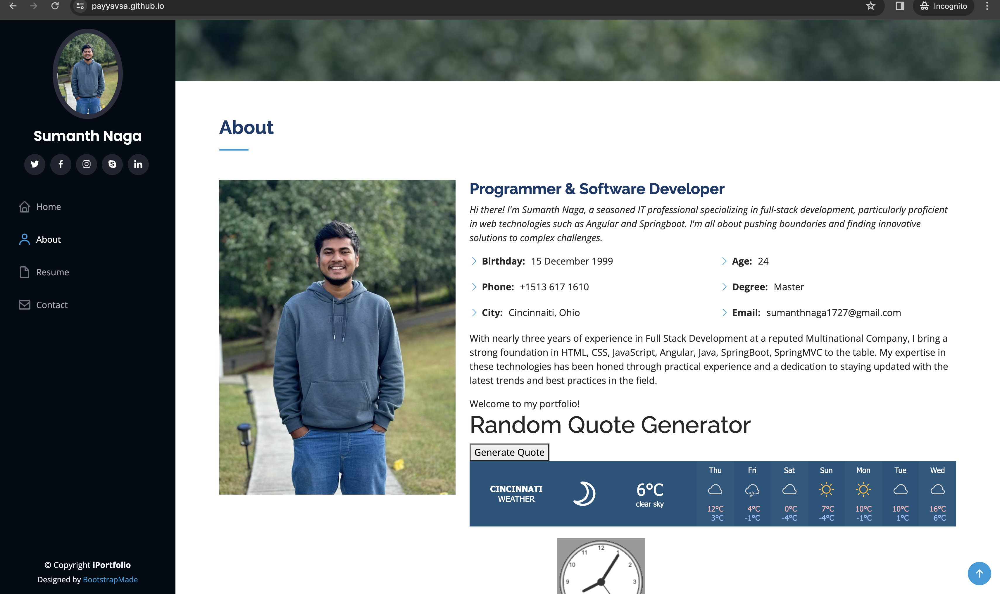

# WAPH-Web Application Programming and Hacking

## Instructor: Dr. Phu Phung

## Student

**Name**: Sumanth Naga Payyavula

**Email**: payyavsa@mail.uc.edu


## Project 1 - Portfolio Website

**Overview**: The goal of this project is to create a front-end website on the github.io cloud service with a professional profile.
I created a personal portfolio as part of this and put it up on the GitHub cloud. Utilizing JQuery, the react library, and simple JavaScript code are among the technical requirements. JavaScript cookies are used to remember the user and welcome them back to the website, and two public web APIs are integrated.
The use of an open-source bootstrap framework and the addition of a Google analytics page tracker are examples of non-technical requirements.

Link to the repository:
[https://github.com/payyavsa/payyavsa.github.io/blob/main/README.md](https://github.com/payyavsa/payyavsa.github.io/blob/main/Readme.md)

Portifolio Url
[https://payyavsa.github.io/](https://payyavsa.github.io/)

\pagebreak

I downloaded a pre-made bootstrap template and altered it to meet the needs of the project in order to create my personal portfolio. This portfolio includes a professional profile that includes my resume, name, headshot, contact details, and background information about my education, experiences, and skills. Furthermore, a link to a new HTML page showcasing the Hackathons and Labs finished as part of the WAPH course work has been included.






\pagebreak

A Google analytics page tracker has been integrated into this portfolio to monitor the traffic and stats .

```JS
<!-- Google tag (gtag.js) -->
<script>
  window.dataLayer = window.dataLayer || [];
  function gtag(){dataLayer.push(arguments);}
  gtag('js', new Date());

  gtag('config', 'G-73KX1F3QQZ');
</script>
```


\pagebreak

This portfolio uses the following tech stack: HTML, CSS, JavaScript, Bootstrap framework, and React library.
The weather widget web service and the random joke generator web service were integrated using JQuery.
There is a joke displayed every minute at random.

Weather Widget code: 
```JS
<div class="weather-widget">
<a class="weatherwidget-io"
 href="https://forecast7.com/en/39d10n84d51/cincinnati/"
	data-label_1="CINCINNATI" data-label_2="WEATHER"
 	data-theme="original" >CINCINNATI WEATHER</a>
<script>
		!function(d,s,id){var js,fjs=d.getElementsByTagName(s)[0];
		if(!d.getElementById(id)){js=d.createElement(s);js.id=id;
		js.src='https://weatherwidget.io/js/widget.min.js';
		fjs.parentNode.insertBefore(js,fjs);}}
(document,'script','weatherwidget-io-js');
</script>
</div>
```


In addition, a few lines of code from lab 2 have been added to display or conceal email and include an analog and digital clock.

\pagebreak

I added a feature to Generate Random Quote. This is the Functionality Code

```JS
  <script>
        const quotes = [
            "The only way to do great work is to love what you do. - Steve Jobs",
            "Innovation distinguishes between a leader and a follower. - Steve Jobs",
            "Stay hungry, stay foolish. - Steve Jobs",
            "Life is what happens when you're busy making other plans. - John Lennon",
            "The future belongs to those who believe in the beauty of their dreams. - Eleanor Roosevelt",
            "Success is not final, failure is not fatal: It is the courage to continue that counts. - Winston Churchill",
            "The only thing we have to fear is fear itself. - Franklin D. Roosevelt"
        ];

        function generateRandomQuote() {
            const randomIndex = Math.floor(Math.random() * quotes.length);
            const quote = quotes[randomIndex];
            document.getElementById('quote').textContent = quote;
        }

        document.getElementById('generate-btn').addEventListener('click', generateRandomQuote);
    </script>

```

\pagebreak

Cookies with JavaScript are used to store user information. "Welcome to my portfolio is displayed" if it is their first visit to the website; otherwise, "welcome back to my portfolioi and time" are displayed.

```JS
<script>
<div id="greetingCookie"></div>
function setCookie(name, value, expiryDays) {
            const d = new Date();
            d.setTime(d.getTime() + (expiryDays*24*60*60*1000));
            let expires = "expires="+ d.toUTCString();
            document.cookie = name + "=" + value + ";" + expires + ";path=/";
        }

        function getCookie(name) {
            let cookieName = name + "=";
            let decodedCookie = decodeURIComponent(document.cookie);
            let ca = decodedCookie.split(';');
            for(let i = 0; i <ca.length; i++) {
                let c = ca[i];
                while (c.charAt(0) == ' ') {
                    c = c.substring(1);
                }
                if (c.indexOf(cookieName) == 0) {
                    return c.substring(cookieName.length, c.length);
                }
            }
            return "";
        }

        function welcomeUser() {
            const lastVisit = getCookie("lastVisit");
            const greetingElement = document.getElementById("greetingCookie");
            if (lastVisit) {
                greetingElement.innerHTML =
		 "Welcome back! Your last visit was on " + lastVisit + ".";
            } else {
                greetingElement.innerHTML = "Welcome My portfolio!";
            }
            const now = new Date();
            setCookie("lastVisit", now.toLocaleString(), 365);
        }

        welcomeUser();
</script>
```




